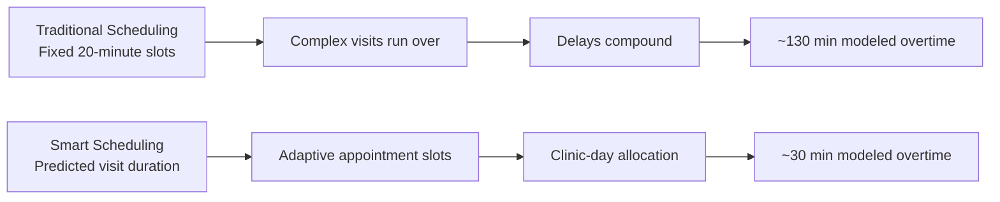
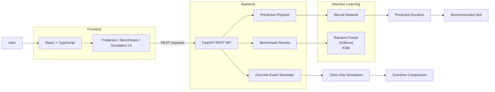
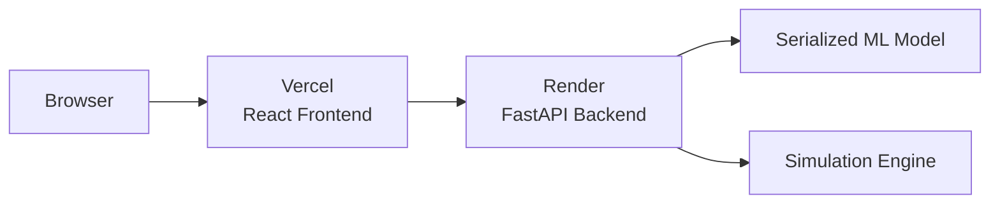
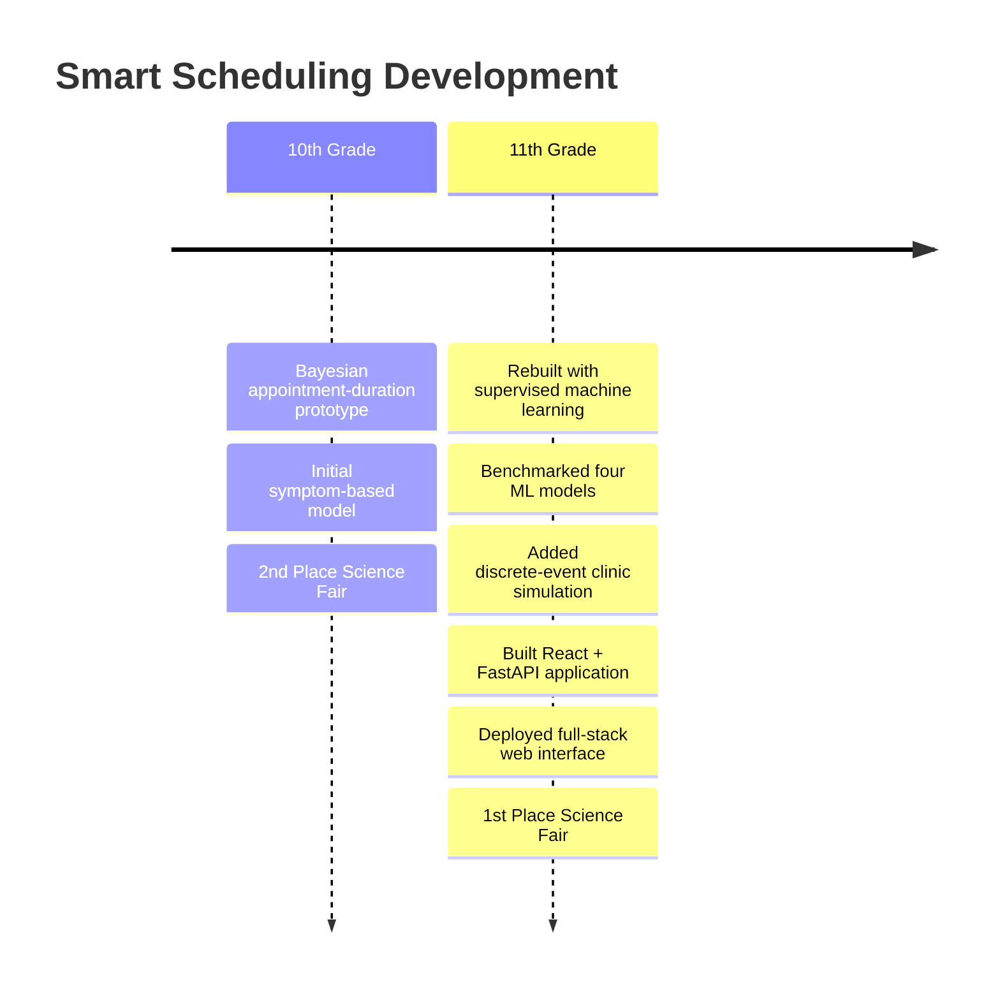
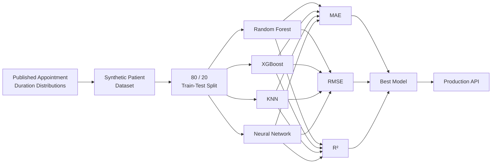

# Smart Scheduling

<p align="center">
  <b>AI-powered healthcare appointment duration prediction and clinic scheduling optimization.</b>
</p>

<p align="center">
  
  
  
  
  
</p>

Built over ~2 years as an independent research project — beginning as a Bayesian prototype and later rebuilt as a full-stack machine learning system with multi-model benchmarking, a discrete-event simulation engine, and a deployed web interface.

<p align="center">
  <a href="https://smart-scheduling-ai.vercel.app/">
    <b>Live Demo</b>
  </a>
</p>

> **Demo note:** The backend is hosted on Render's free tier and may take ~30–60 seconds to wake after inactivity. Subsequent predictions are typically immediate.

---

## Key Results

<table>
<tr>
<td align="center">
  <h3>~77%</h3>
  <sub>Modeled Overtime Reduction</sub>
</td>
<td align="center">
  <h3>3.74 min</h3>
  <sub>Prediction MAE</sub>
</td>
<td align="center">
  <h3>0.825</h3>
  <sub>R²</sub>
</td>
<td align="center">
  <h3>4</h3>
  <sub>Models Benchmarked</sub>
</td>
</tr>
</table>

- Reduced modeled daily clinic overtime from **~130 minutes to ~30 minutes**
- Benchmarked four machine learning approaches on **2,000 synthetic patient records**
- Built the complete system end-to-end: **data generation → model training → API → simulation → frontend → deployment**
- Developed the project across multiple years, progressing from a Bayesian prototype to a production full-stack ML application

---

## Demo

<!--
Add screenshots or a GIF to a /docs folder in the repository.

Recommended files:
docs/demo.gif
docs/predict.png
docs/simulation.png
docs/benchmark.png

Then uncomment the sections below.
-->

<!--
<p align="center">
  
</p>
-->

<!--
### Appointment Duration Prediction

<p align="center">
  
</p>

### Clinic-Day Simulation

<p align="center">
  
</p>

### Model Benchmarking

<p align="center">
  
</p>
-->

---

## The Problem

Healthcare clinics often rely on fixed appointment slots — commonly around 20 minutes — regardless of visit complexity.

A medication refill and a new-patient intake may therefore receive the same scheduled duration even though their actual time requirements can differ substantially.

This can create two problems:

- Shorter visits leave unused scheduling capacity
- Longer visits run over their assigned slots, causing delays that compound throughout the clinic day

Smart Scheduling explores whether patient and appointment characteristics can be used to predict visit duration and generate more adaptive scheduling recommendations.

---

## What It Does

Smart Scheduling predicts the expected duration of an individual appointment using:

- Visit type
- Patient age
- Insurance type
- Provider type
- Day of week
- Chronic condition count
- First-visit status
- Late-arrival time
- Visit complexity

The system then converts the prediction into a recommended appointment slot.

Predictions can also be passed into a discrete-event clinic simulation that compares AI-assisted scheduling against traditional fixed-slot scheduling across an entire clinic day.

---

## Traditional vs. AI-Assisted Scheduling



**Modeled reduction in daily overtime: ~77%**

---

## Results on Simulated Clinic Days

| Metric | Fixed Scheduling | AI Scheduling |
|---|---:|---:|
| Daily overtime | ~130 min | ~30 min |
| Overtime reduction | — | **~77%** |
| Avg. prediction error | — | **3.74 min** |
| Variance explained (R²) | — | **0.825** |

These results come from simulated clinic days generated using the project's synthetic patient dataset and appointment-duration model.

---

## Model Comparison

Four models were trained and benchmarked on **2,000 synthetic patient records** using an **80/20 train-test split**.

| Model | MAE (min) ↓ | RMSE (min) ↓ | R² ↑ |
|---|---:|---:|---:|
| **Neural Network** | **3.74** | **4.93** | **0.825** |
| XGBoost | 3.99 | 5.28 | 0.800 |
| Random Forest | 3.99 | 5.35 | 0.794 |
| KNN | 4.62 | 6.25 | 0.719 |

The **Neural Network** was selected for deployment based on overall predictive performance.

### Deployed Model

**Inputs**

`visit type` · `age` · `insurance` · `provider` · `day of week` · `chronic conditions` · `first visit` · `late arrival` · `complexity`

**Output**

`predicted visit duration → recommended scheduling slot`

---

## System Architecture



### Deployment



---

## Project Evolution



The project began in 10th grade as a Bayesian prototype using a simpler symptom-based dataset.

In 11th grade, it was rebuilt into the current system with supervised machine learning, multi-model benchmarking, discrete-event simulation, a REST API, and a production web interface.

---

## Recognition

- **1st Place — Coppell High School Science Fair, Robotics & Machine Learning (11th Grade)**
- **2nd Place — Coppell High School Science Fair, Robotics & Machine Learning (10th Grade)**

---

## Tech Stack

### Machine Learning


### Backend


### Frontend


### Deployment


---

## API

The frontend communicates with the machine-learning backend through a FastAPI REST API.

| Method | Endpoint | Description |
|---|---|---|
| `POST` | `/predict` | Predict appointment duration for one patient |
| `GET` | `/benchmark` | Return benchmark metrics for trained models |
| `POST` | `/simulate` | Run a full clinic-day simulation |
| `GET` | `/visit-types` | Return valid input categories |
| `GET` | `/health` | Backend health check |

### Example Prediction Request

```json
{
  "visit_type": "Hypertension Follow-up",
  "age": 58,
  "insurance_type": "Medicare",
  "provider_type": "MD",
  "day_of_week": "Monday",
  "num_conditions": 2,
  "is_first_visit": 0,
  "arrived_late_min": 0
}
```

### Example Response Structure

```json
{
  "predicted_duration_min": 18.7,
  "recommended_slot_min": 21.5,
  "confidence_interval": [
    15.0,
    22.4
  ],
  "traditional_slot_min": 20,
  "model_used": "Neural Network"
}
```

---

## Project Structure

```text
smart-scheduling/
│
├── backend/
│   │
│   ├── data/
│   │   └── generate.py              # Synthetic dataset generator
│   │
│   ├── models/
│   │   ├── best_model.joblib        # Deployed trained model
│   │   └── benchmark_results.json   # Model performance metrics
│   │
│   ├── main.py                      # FastAPI REST endpoints
│   ├── train.py                     # Four-model training pipeline
│   ├── simulate.py                  # Discrete-event clinic simulation
│   └── requirements.txt
│
└── frontend/
    │
    └── src/
        │
        ├── pages/
        │   ├── PredictPage.tsx      # Patient intake + prediction
        │   ├── BenchmarkPage.tsx    # Model comparison dashboard
        │   └── SimulatePage.tsx     # Clinic-day simulation
        │
        ├── api.ts                   # Backend API client
        └── types/
            └── index.ts
```

---

## Dataset

The model was trained on **2,000 synthetic patient records** generated using distributions derived from published primary-care appointment-duration research, including Tai-Seale et al. (2017), *JAMA Internal Medicine*.

Synthetic data was used because real patient scheduling records contain protected health information.

The generated dataset incorporates variation across:

- Visit type
- Patient age
- Insurance type
- Provider type
- Day of week
- Chronic condition count
- First-visit status
- Late arrival
- Visit complexity

---

## Training Pipeline



---

## Limitations

Current results are based on synthetic patient records generated from published primary-care appointment-duration distributions rather than protected clinical data.

---

## Running Locally

### 1. Clone the Repository

```bash
git clone https://github.com/Ixhi08/smart-scheduling.git
cd smart-scheduling
```

### 2. Start the Backend

```bash
cd backend

pip3 install -r requirements.txt

# Generate dataset
python3 data/generate.py

# Train and benchmark all four models
python3 train.py

# Start FastAPI
uvicorn main:app --reload --port 8000
```

Backend:

```text
http://localhost:8000
```

Interactive API documentation:

```text
http://localhost:8000/docs
```

### 3. Start the Frontend

Open another terminal:

```bash
cd frontend

npm install
npm start
```

Frontend:

```text
http://localhost:3000
```

For deployment, set:

```text
REACT_APP_API_URL=<your-backend-url>
```

---

## Live Application

**Frontend:**  
https://smart-scheduling-ai.vercel.app/

The production frontend is hosted on Vercel and communicates with a FastAPI backend hosted on Render.

> Because the backend currently uses Render's free tier, the first request after a period of inactivity may take approximately 30–60 seconds while the service wakes. Requests are typically immediate once the backend is active.

---

<p align="center">
  <b>Smart Scheduling</b><br>
  Independent machine learning + healthcare scheduling research project
</p>
