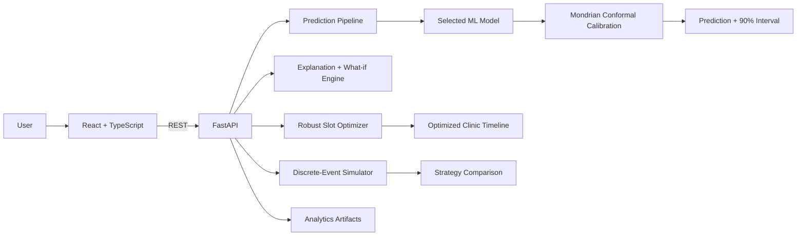
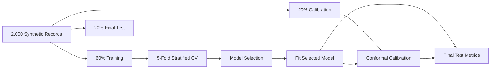
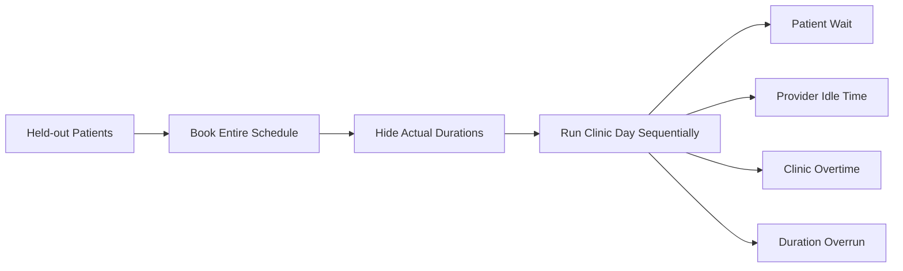

# Smart Scheduling

<p align="center">
  <b>Uncertainty-aware machine learning for healthcare appointment duration prediction and clinic scheduling.</b>
</p>

<p align="center">
  
  
  
  
  
  
  
</p>

Built over ~2 years as an independent research project. Smart Scheduling began as a Bayesian appointment-duration prototype and evolved into a full-stack ML system with model benchmarking, calibrated uncertainty, local sensitivity analysis, constrained slot optimization, discrete-event simulation, and an interactive analytics dashboard.

<p align="center">
  <a href="https://smart-scheduling-ai.vercel.app/"><b>Live Demo</b></a>
  &nbsp;•&nbsp;
  <a href="#methodology"><b>Methodology</b></a>
  &nbsp;•&nbsp;
  <a href="#running-locally"><b>Run Locally</b></a>
</p>

> **Demo note:** the backend currently runs on Render's free tier. The first request after inactivity may take ~30–60 seconds while the service wakes; later requests are typically immediate.

## What makes this version different

<table>
<tr>
<td align="center"><b>4</b><br><sub>ML models benchmarked</sub></td>
<td align="center"><b>90%</b><br><sub>Calibrated conformal intervals</sub></td>
<td align="center"><b>3</b><br><sub>Scheduling strategies</sub></td>
<td align="center"><b>5</b><br><sub>Interactive analysis views</sub></td>
</tr>
</table>

- **Rigorous model selection:** 5-fold stratified cross-validation on the training split only
- **Separate calibration:** Mondrian split-conformal prediction intervals by visit type, with a global finite-sample fallback
- **Interpretable predictions:** local sequential sensitivity analysis plus interactive what-if curves
- **Capacity-aware scheduling:** robust 5-minute slot allocation that preserves more buffer for higher-uncertainty appointments
- **No-lookahead simulation:** schedules are booked before actual durations are revealed and evaluated on a separate synthetic evaluation pool
- **Input audit:** insurance, arrival lateness, and hand-coded complexity are excluded from the predictive model
- **Subgroup diagnostics:** age and insurance-group error/coverage checks are reported without using insurance as a predictor
- **Model diagnostics:** predicted-vs-actual scatter, residuals, subgroup error, conformal coverage, and permutation feature importance

## Application

The interface is organized into five views:

| View | Purpose |
|---|---|
| **Predict** | Point prediction, 90% calibrated interval, uncertainty level, and robust recommended slot |
| **Explain** | Local sensitivity contributions and what-if curves for patient characteristics |
| **Optimize** | Clinic constraints, robust slot allocation, optional risk-first ordering, and appointment plan |
| **Simulation** | Side-by-side fixed, adaptive, and optimized clinic-day schedules |
| **Model Analytics** | Holdout metrics, calibration, residuals, subgroup error, and feature importance |

## The problem

Healthcare clinics often use fixed appointment slots even when visit complexity differs substantially. A medication refill and a new-patient intake may receive the same scheduled duration, which can produce either unused capacity or cascading delays.

Smart Scheduling predicts visit duration from appointment and patient characteristics, quantifies predictive uncertainty, and uses those estimates to construct more adaptive clinic schedules.

## Prediction inputs

The deployed model uses:

- Visit type
- Patient age
- Provider type
- Day of week
- Chronic condition count
- First-visit status

The output includes a point prediction, calibrated interval, relative uncertainty category, and recommended appointment slot.

**Deliberately excluded from prediction:** insurance type (audit-only), arrival lateness (not known when a future appointment is booked), and any hand-coded complexity score (redundant with visit type and too easy to make target-informed).

## System architecture



## Methodology

### 1. Train / calibration / test separation



The final test split is not used to choose the model or calibrate prediction intervals.

### 2. Model benchmark

Four regression approaches are trained and compared:

- Random Forest
- XGBoost
- K-Nearest Neighbors
- Feedforward Neural Network (`MLPRegressor`)

The deployed model is selected by the lowest mean cross-validation MAE on the training split.

### 3. Calibrated uncertainty

The original project used a heuristic `prediction ± MAE` interval. The current version instead uses **90% split-conformal prediction intervals**.

Calibration is performed by visit type when enough calibration observations are available. Rare categories fall back to the global finite-sample conformal residual quantile. The 90% level is a nominal conformal target; empirical coverage can vary in finite held-out subgroups, especially for rare visit types.

For an individual visit:

```text
point prediction
      ↓
visit-type conformal residual radius
      ↓
90% calibrated prediction interval
      ↓
upper interval bound
      ↓
rounded to next 5-minute scheduling increment
      ↓
recommended robust slot
```

### 4. Local explanation

The Explain view uses **sequential local sensitivity**, not SHAP and not causal attribution.

Starting from a training-set reference patient, features are changed one at a time in a documented order. Each bar shows the change in model prediction produced by that step. The contributions sum to the difference between the reference prediction and the selected patient prediction, but they are explicitly described as path-dependent sensitivity estimates.

Interactive what-if curves show how predictions change when varying:

- Number of chronic conditions
- Day of week
- Age
- First vs. returning visit

### 5. Robust slot optimization

The optimizer begins with two slot targets:

- **Base slot:** point prediction rounded to the next 5 minutes
- **Desired robust slot:** conformal upper bound rounded to the next 5 minutes

If all desired robust slots fit, they are retained. If they exceed clinic capacity but base slots still fit, the allocator removes 5-minute buffer increments by the smallest marginal increase in a weighted quadratic buffer-loss objective. This is a discrete separable convex allocation problem: higher-uncertainty visits receive larger penalties for buffer removal and are therefore more strongly protected from compression.

The optimizer never compresses a slot below the rounded point prediction simply to claim that the schedule fits.

An optional **risk-first ordering heuristic** schedules appointments with larger predicted duration + uncertainty earlier. This heuristic uses model outputs only — never realized appointment durations.

### 6. Corrected clinic simulation

The initial version advanced future scheduled start times after seeing earlier actual durations. That allowed future schedules to react to information that would not be known when appointments were booked.

The current simulation removes that look-ahead:



All scheduled start times are determined **before** actual durations are used. Realized durations are then revealed only during simulation to evaluate the schedule.

The simulator uses a **separate deterministic synthetic evaluation dataset** generated with a different random seed. It is not used for model selection, fitting, conformal calibration, or final-test analytics.

## Scheduling strategies

### Fixed scheduling

Every patient receives a 20-minute appointment slot.

### Conformal adaptive scheduling

Each patient receives the upper 90% conformal bound rounded to the next 5 minutes. This is intentionally conservative and is not capacity constrained.

### Optimized robust scheduling

Conformal buffer is allocated subject to clinic working capacity and a configurable closing reserve. The UI reports whether the requested patient load is feasible without compressing below point-prediction slots.

## Scenario presets

The simulator includes demonstration presets:

- Primary Care
- Pediatrics
- Cardiology
- Urgent Care

These presets filter visit type and age ranges from the separate synthetic simulation-evaluation pool. They are not separate specialty-trained models and should not be interpreted as specialty-specific clinical validation.

## Current held-out results

On the untouched 20% final test split of the synthetic development dataset, the selected neural network achieved:

- **MAE:** 3.909 minutes
- **RMSE:** 5.193 minutes
- **R²:** 0.7536
- **90% nominal conformal coverage:** 93.5% empirical coverage
- **Average prediction-interval width:** 19.99 minutes

These are synthetic held-out results, not clinical validation.

## Model analytics

The analytics dashboard includes:

- Cross-validation model-selection metrics
- Final held-out test-set MAE, RMSE, and R²
- Predicted vs. actual scatterplot
- Residual histogram
- Permutation feature importance
- Error by visit type
- Error by age group
- Insurance-group error/coverage audit while insurance remains excluded from the model
- Conformal interval coverage and width

## Dataset

The model-development dataset contains **2,000 synthetic records**. A separate **1,500-record synthetic evaluation pool** is generated with another seed for clinic-simulation experiments.

The overall duration scale is motivated by published primary-care literature. For example, Chen, Farwell & Jha reported a mean adult primary-care visit duration of 18.9 minutes in nationally representative 1997–2005 NAMCS data ([Arch Intern Med. 2009;169(20):1866–1872](https://doi.org/10.1001/archinternmed.2009.341)).

The individual visit-type baselines and feature multipliers in this repository are **transparent synthetic assumptions for simulation**, not clinically estimated coefficients. Synthetic data is used instead of real clinical scheduling records because real patient data can contain protected health information.

The generator is deterministic by default (`seed=42` for model development; `seed=2026` for simulation evaluation) so experiments are reproducible.

## Limitations

This project is a research and engineering demonstration, not a clinical scheduling system. Results are based on synthetic data and have not been externally validated on real clinic operations.

The synthetic generator contains manually specified visit-type baselines and operational effects; these should not be interpreted as learned clinical relationships. Insurance is retained only for subgroup auditing and is not a model input or duration-generating factor. Arrival lateness is used only during clinic simulation and is not used to predict visit duration.

The local explanation is a sensitivity method rather than a causal explanation. Scenario presets are filtered demonstrations rather than independently trained specialty models. Subgroup diagnostics on synthetic data are methodological checks, not evidence of real-world fairness or equity.

## Recognition

- **1st Place — Coppell High School Science Fair, Robotics & Machine Learning (11th Grade)**
- **2nd Place — Coppell High School Science Fair, Robotics & Machine Learning (10th Grade)**

## Tech stack

**Machine Learning:** Python · scikit-learn · XGBoost · NumPy · Pandas · Joblib  
**Backend:** FastAPI · Pydantic · Uvicorn  
**Frontend:** React · TypeScript · Recharts · Lucide  
**Deployment:** Vercel (frontend) · Render (backend)

## API

| Method | Endpoint | Description |
|---|---|---|
| `POST` | `/predict` | Duration prediction + calibrated interval + robust slot |
| `POST` | `/explain` | Local sensitivity explanation + batched what-if analysis |
| `GET` | `/benchmark` | Model, calibration, and test analytics |
| `POST` | `/simulate` | Fixed/adaptive/optimized clinic-day simulation |
| `GET` | `/visit-types` | Valid inputs + scenario presets |
| `GET` | `/health` | Backend health check |

## Project structure

```text
smart-scheduling/
├── backend/
│   ├── data/
│   │   ├── generate.py
│   │   ├── smart_scheduling_data.csv
│   │   └── simulation_evaluation_data.csv
│   ├── models/
│   │   ├── best_model.joblib
│   │   ├── preprocessor.joblib
│   │   └── benchmark_results.json
│   ├── train.py
│   ├── main.py
│   ├── simulate.py
│   └── requirements.txt
│
└── frontend/
    └── src/
        ├── components/
        │   ├── Common.tsx
        │   ├── Nav.tsx
        │   └── ScheduleTimeline.tsx
        ├── pages/
        │   ├── PredictPage.tsx
        │   ├── ExplainPage.tsx
        │   ├── OptimizePage.tsx
        │   ├── SimulatePage.tsx
        │   └── BenchmarkPage.tsx
        ├── api.ts
        └── types/
            └── index.ts
```

## Running locally

### Backend

```bash
cd backend
pip3 install -r requirements.txt

# Regenerate both deterministic synthetic datasets
python3 data/generate.py

# REQUIRED after pulling methodology/model changes
python3 train.py

uvicorn main:app --reload --port 8000
```

FastAPI docs are available at:

```text
http://localhost:8000/docs
```

### Frontend

```bash
cd frontend
npm install
npm start
```

The frontend runs at:

```text
http://localhost:3000
```

For deployment, set:

```text
REACT_APP_API_URL=<your-backend-url>
```

## Deployment note

`best_model.joblib`, `preprocessor.joblib`, and `benchmark_results.json` must come from the **same training run**. After changing `train.py`, regenerate all three artifacts together before deploying the backend.

<p align="center">
  <b>Smart Scheduling</b><br>
  Independent ML + healthcare scheduling research project
</p>
