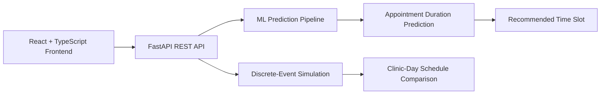

# Smart Scheduling

AI-powered healthcare appointment duration predictor and clinic scheduling optimizer.

Built over ~2 years as an independent research project — beginning as a Bayesian prototype and later rebuilt as a full-stack machine learning system with multi-model benchmarking, a discrete-event simulation engine, and a deployed web interface.

**Live Demo:** https://smart-scheduling-ai.vercel.app/

> **Demo note:** The backend is hosted on Render's free tier and may take ~30–60 seconds to wake after inactivity. Subsequent predictions are typically immediate.

---

## Highlights

- Reduced modeled daily clinic overtime by **~77%** (~130 min → ~30 min)
- Achieved **3.74 min MAE** on appointment-duration prediction
- Deployed model achieved **R² = 0.825**
- Benchmarked **4 machine learning models** on 2,000 synthetic patient records
- Built the full system end-to-end: data generation → model training → API → simulation → web deployment

---

## What It Does

Healthcare clinics often rely on fixed appointment slots, such as 20 minutes, regardless of visit complexity.

That can leave excessive unused time for shorter visits while causing more complex visits to run over, creating delays that compound throughout the clinic day.

Smart Scheduling predicts how long an individual appointment is likely to take using:

- Visit type
- Patient age
- Insurance type
- Provider type
- Day of week
- Chronic condition count
- First-visit status
- Late-arrival time

The prediction is then used to generate a recommended appointment slot and can be incorporated into a full clinic-day simulation to compare AI-assisted scheduling with traditional fixed scheduling.

### Results on Simulated Clinic Days

| Metric | Fixed Scheduling | AI Scheduling |
|---|---:|---:|
| Daily overtime | ~130 min | ~30 min |
| Overtime reduction | — | **~77%** |
| Avg. prediction error | — | **3.74 min** |
| Variance explained (R²) | — | **0.825** |

---

## Model Comparison

Four models were trained and benchmarked on **2,000 synthetic patient records** using an 80/20 train-test split.

| Model | MAE (min) | RMSE (min) | R² |
|---|---:|---:|---:|
| **Neural Network** | **3.74** | **4.93** | **0.825** |
| Random Forest | 3.99 | 5.35 | 0.794 |
| XGBoost | 3.99 | 5.28 | 0.800 |
| KNN | 4.62 | 6.25 | 0.719 |

The **Neural Network** was selected for deployment based on overall predictive performance.

---

## Architecture



---

## Project Evolution

```text
10th Grade
    ↓
Bayesian appointment-duration prototype
    ↓
Synthetic healthcare dataset
    ↓
11th Grade
    ↓
Supervised machine learning rebuild
    ↓
4-model benchmark
    ↓
Neural network predictor
    ↓
Discrete-event clinic simulation
    ↓
React + FastAPI full-stack application
    ↓
Production deployment
```

The project began in 10th grade as a Bayesian prototype using a simple symptom dataset.

In 11th grade, it was rebuilt with supervised machine learning, a multi-model benchmarking pipeline, discrete-event simulation, and a full-stack web interface.

---

## Recognition

- **1st Place — Coppell High School Science Fair, Robotics & Machine Learning (11th Grade)**
- **2nd Place — Coppell High School Science Fair, Robotics & Machine Learning (10th Grade)**

---

## Tech Stack

### Backend

- FastAPI
- scikit-learn
- XGBoost
- NumPy
- Pandas
- Joblib

### Frontend

- React
- TypeScript
- Recharts
- Lucide

### Deployment

- Vercel — frontend
- Render — backend

---

## API

| Method | Endpoint | Description |
|---|---|---|
| `POST` | `/predict` | Predict appointment duration for one patient |
| `GET` | `/benchmark` | Return model comparison results |
| `POST` | `/simulate` | Run a full clinic-day simulation |
| `GET` | `/visit-types` | Return valid input categories |
| `GET` | `/health` | Backend health check |

---

## Project Structure

```text
smart-scheduling/
├── backend/
│   ├── data/
│   │   └── generate.py
│   ├── models/
│   │   ├── best_model.joblib
│   │   └── benchmark_results.json
│   ├── main.py
│   ├── train.py
│   └── simulate.py
│
└── frontend/
    └── src/
        ├── pages/
        │   ├── PredictPage.tsx
        │   ├── BenchmarkPage.tsx
        │   └── SimulatePage.tsx
        ├── api.ts
        └── types/
            └── index.ts
```

---

## Dataset

The model was trained on **2,000 synthetic patient records** generated using distributions derived from published primary-care appointment-duration research, including Tai-Seale et al. (2017), *JAMA Internal Medicine*.

Synthetic data was used because real patient scheduling records contain protected health information.

The generated dataset incorporates variation across factors including:

- Visit type
- Age
- Insurance type
- Provider type
- Day of week
- Chronic condition count
- First-visit status
- Late arrival
- Visit complexity

---

## Limitations

Current results are based on synthetic patient records generated from published primary-care appointment-duration distributions rather than protected clinical data.

---

## Running Locally

### Backend

```bash
cd backend
pip3 install -r requirements.txt

# Generate the dataset and train all four models
python3 data/generate.py
python3 train.py

# Start the API
uvicorn main:app --reload --port 8000
```

The backend runs at:

```text
http://localhost:8000
```

Interactive FastAPI documentation:

```text
http://localhost:8000/docs
```

### Frontend

```bash
cd frontend
npm install
npm start
```

The frontend runs at:

```text
http://localhost:3000
```

Set `REACT_APP_API_URL` to the backend URL when deploying the application.
